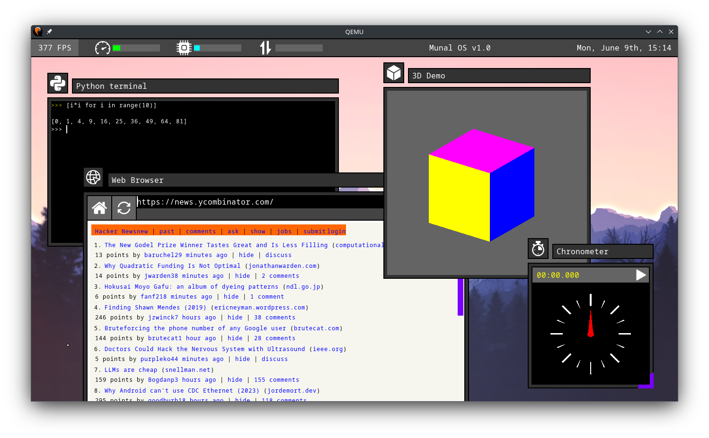

+++
title = "Projets personnels"
+++

## Munal OS

<a class="github-button" href="https://github.com/Askannz/munal-os" data-color-scheme="no-preference: light; light: light; dark: dark;" data-icon="octicon-star" data-size="large" data-show-count="true" aria-label="Star Askannz/munal-os on GitHub">Github stars</a>

[https://github.com/Askannz/munal-os](https://github.com/Askannz/munal-os)

**Post Hacker News:** [https://news.ycombinator.com/item?id=44226879](https://news.ycombinator.com/item?id=44226879)

De loin mon plus gros projet, un système d'exploitation écrit de zéro en Rust.

Il possède un environnement de bureau fonctionnel, un pilote PCI, des pilotes QEMU pour la souris, le clavier, le réseau et la carte graphique, et une sélections d'applications (codées spécifiquement pour l'OS) incluant un navigateur web basique et un terminal Python.

Pour l'architecture du kernel j'ai expérimenté avec une nouvelle approche: au lieu de faire tourner les applications dans un espace d'addresse virtuel, elles sont compilées en WebAssembly et tournent dans un moteur WASM intégré. Voir le README pour plus de détail.

## optimus-manager

<a class="github-button" href="https://github.com/Askannz/optimus-manager" data-color-scheme="no-preference: light; light: light; dark: dark;" data-icon="octicon-star" data-size="large" data-show-count="true" aria-label="Star Askannz/optimus-manager on GitHub">Github stars</a>

[https://github.com/Askannz/optimus-manager](https://github.com/Askannz/optimus-manager)

Il s'agit d'un utilitaire en ligne de commande que j'avais écrit pour résoudre un problème spécifique: certains ordinateurs portables (surtout les modèles "gamings") possèdent deux cartes graphiques, une petite pour l'utilisation de bureau normale et une grosse pour les appliations lourdes comme les jeux.

Jusqu'à récement cette configuration matérielle était très mal supportée par les distributions Linux, et donc le but d'optimus-manager est de fournir un moyen simple de passer d'une carte graphique à l'autre ou d'éteindre celle inutilisée pour économiser la batterie.

J'avais écrit ce programme pour mon usage personnel à l'origine, mais après l'avoir publié comme [paquet Archlinux](https://aur.archlinux.org/packages/optimus-manager-git) il est devenu très populaire, atteignant plus de 2000 "stars" sur GitHub au cours des ans ([quelqu'un a même pris la peine de créer une interface graphique dédiée](https://github.com/Shatur/optimus-manager-qt)). Le projet est passé par plusieurs versions depuis, pour ajouter des fonctionnalités et améliorer la stabilité ainsi que la compatibilité.

Je ne m'en occupe plus aujourd'hui (je n'ai plus le matériel pour le tester correctement), mais j'ai passé la main à un membre de la communauté qui continue le développement (merci [es20490446e](https://github.com/es20490446e)).

## msi-perkeyrgb

<a class="github-button" href="https://github.com/Askannz/msi-perkeyrgb" data-color-scheme="no-preference: light; light: light; dark: dark;" data-icon="octicon-star" data-size="large" data-show-count="true" aria-label="Star Askannz/msi-perkeyrgb on GitHub">Github stars</a>

[https://github.com/Askannz/msi-perkeyrgb](https://github.com/Askannz/msi-perkeyrgb)

Un projet de vacances dont le but était de faire un reverse-engineering du protocole qui permet de contrôler l'éclairage RGB du clavier d'un PC portable MSI. Il a fallu inspecter le traffic USB via l'application Wireshark, analyser le traffic, et faire le détective pour comprendre quelles séquences correspondaient à quels effets de lumière.

## OxyDICOM

[https://github.com/Askannz/oxydicom](https://github.com/Askannz/oxydicom)

Une application capable de lire des images au format DICOM.

DICOM est un format de données utilisé dans le domaine médical, auquel j'ai été beaucoup confronté lorsque je travaillais à See-Mode. Il sert à stocker des images et vidéos dans un format standard et accompagné de métadonnées (comme le nom du patient, de la procédure, etc).

OxyDICOM est capable de décoder une partie des formats d'images supportés par la spécification DICOM, ainsi que d'extraire et d'afficher l'arbre de métadonnées (les "DICOM tags"). L'application est écrite en Rust et utilise le toolkit [iced](https://github.com/iced-rs/iced) (enfin, une version de ce toolkit qui doit être un peu datée maintenant).

## Nag

[https://github.com/Askannz/nag](https://github.com/Askannz/nag)

Un bot Telegram capable d'enregistrer des rappels à une date ou une fréquence indiquée en langage naturel. Par example, "every day at 3pm", "on March 13th", etc.
